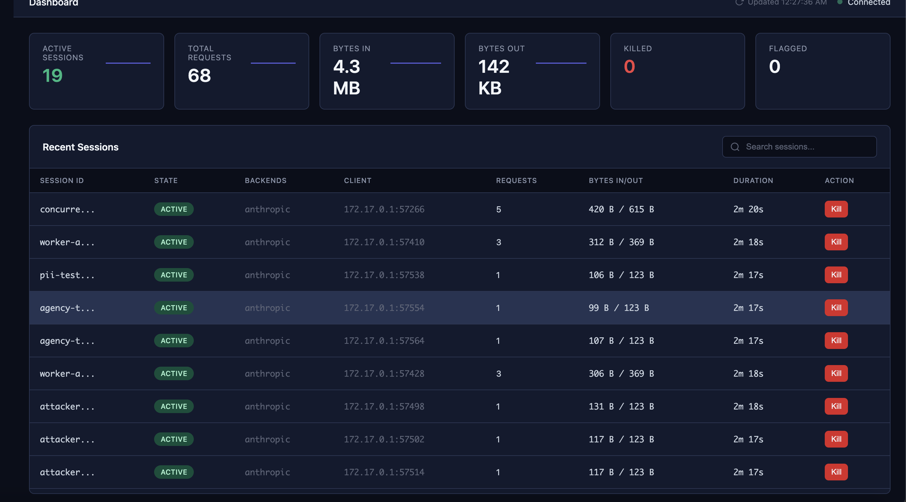

# ELIDA

**Session-aware reverse proxy for AI agents**

[](LICENSE)
[](https://go.dev/)
[](https://github.com/zamorofthat/elida/actions/workflows/ci.yml)
[](https://scorecard.dev/viewer/?uri=github.com/zamorofthat/elida)
[](https://codecov.io/gh/zamorofthat/elida)

Think Session Border Controller (SBC) from telecom — but instead of managing VoIP calls, ELIDA sits between your AI agents and model APIs, giving you visibility and control over every session.

---

- **Kill runaway agents mid-session** — one API call terminates a session instantly
- **40+ OWASP LLM Top 10 rules** — prompt injection, PII leaks, tool abuse, all caught in-line
- **Session-aware failover** — route across providers (OpenAI, Anthropic, Ollama, Mistral) with sticky sessions
- **Complete audit trail** — every session logged with request/response capture and PII redaction
- **Real-time dashboard** — watch every request, token burn, and policy violation as it happens

## 30-Second Quickstart

```bash
docker run -p 8080:8080 -p 9090:9090 \
  -e ELIDA_BACKEND=https://api.groq.com/openai/v1 \
  ghcr.io/zamorofthat/elida:latest
```

Point your client at it:

```bash
# Claude Code
ANTHROPIC_BASE_URL=http://localhost:8080 claude

# Any OpenAI-compatible tool
OPENAI_BASE_URL=http://localhost:8080 your-tool
```

Open the dashboard at [http://localhost:9090](http://localhost:9090).



## How It Works

```
              ┌─────────────────────────────────────────┐
              │                 ELIDA                    │
              │                                         │
              │  ┌───────────┐   ┌──────────────────┐   │
 Agents ──────┼─▶│   Proxy   │──▶│  Multi-Backend   │───┼──▶ OpenAI
              │  │  Handler  │   │     Router       │   │──▶ Anthropic
              │  └─────┬─────┘   └──────────────────┘   │──▶ Ollama
              │        │                                │──▶ Mistral
              │  ┌─────▼─────┐   ┌──────────────────┐   │
              │  │  Session  │   │   Control API    │───┼──▶ :9090
              │  │  Manager  │   │   + Dashboard    │   │
              │  └─────┬─────┘   └──────────────────┘   │
              │        │                                │
              │  ┌─────▼─────┐   ┌──────────────────┐   │
              │  │  Policy   │   │    Telemetry     │   │
              │  │  Engine   │   │  (OTEL/SQLite)   │   │
              │  └───────────┘   └──────────────────┘   │
              └─────────────────────────────────────────┘
```

Every request flows through session tracking and policy evaluation before reaching backends. Sessions are first-class — you can inspect, pause, or kill any agent session via the control API or dashboard.

## Key Features

### Session Control
- **Kill switch** — terminate any session via API or dashboard
- **Idle timeouts** — auto-expire inactive sessions (default: 5m)
- **Kill block** — prevent killed sessions from reconnecting (duration, until-hour-change, or permanent)
- **Session-aware routing** — sticky sessions across multi-backend configurations

### Security
- **40+ policy rules** mapped to OWASP LLM Top 10 categories
- **Prompt injection detection** (LLM01) — pattern-based request scanning
- **PII and credential detection** (LLM06) — block sensitive data in responses
- **Tool abuse prevention** (LLM07/08) — block dangerous tool calls
- **Risk ladder** — progressive escalation: log → flag → throttle → block → kill
- **Policy presets** — `minimal` (8 rules), `standard` (38), `strict` (46)

### Observability
- **OpenTelemetry** — traces, metrics, and logs via OTLP
- **Real-time dashboard** — Preact UI on the control port
- **Session history** — SQLite-backed audit log with full request/response capture
- **Event stream** — immutable audit trail with PII redaction

### Enterprise
- **Multi-backend routing** — route by model name, header, path, or default
- **Redis session store** — horizontal scaling across instances
- **Helm chart** — production Kubernetes deployment
- **WebSocket support** — voice sessions (OpenAI Realtime, Deepgram, ElevenLabs, LiveKit)

## Configuration

YAML:
```yaml
# configs/elida.yaml
listen: ":8080"
backend: "https://api.anthropic.com"

session:
  timeout: 5m

policy:
  enabled: true
  preset: standard  # minimal | standard | strict
```

Environment variables:
```bash
ELIDA_BACKEND=https://api.anthropic.com \
ELIDA_POLICY_ENABLED=true \
ELIDA_POLICY_PRESET=standard \
./bin/elida
```

Multi-backend:
```yaml
backends:
  anthropic:
    url: "https://api.anthropic.com"
    type: anthropic
    models: ["claude-*"]
    default: true
  openai:
    url: "https://api.openai.com/v1"
    type: openai
    models: ["gpt-*", "o*"]
```

See the [Configuration Guide](docs/CONFIGURATION.md) for full options.

## Client Examples

```bash
# Claude Code
ANTHROPIC_BASE_URL=http://localhost:8080 claude

# OpenAI Python SDK
export OPENAI_BASE_URL=http://localhost:8080
python my_agent.py

# curl
curl http://localhost:8080/v1/chat/completions \
  -H "Content-Type: application/json" \
  -H "Authorization: Bearer $API_KEY" \
  -d '{"model": "gpt-4", "messages": [{"role": "user", "content": "Hello"}]}'
```

## Control API

```bash
# List active sessions
curl http://localhost:9090/control/sessions

# Kill a runaway session
curl -X POST http://localhost:9090/control/sessions/{id}/kill

# View policy violations
curl http://localhost:9090/control/flagged

# Audit event log
curl http://localhost:9090/control/events
```

See the [API Reference](docs/API.md) for all endpoints.

## Documentation

| Guide | Description |
|-------|-------------|
| [Getting Started](docs/GETTING_STARTED.md) | Step-by-step tutorial |
| [Configuration](docs/CONFIGURATION.md) | YAML and environment variable options |
| [API Reference](docs/API.md) | Control API endpoints |
| [Policy Rules](docs/POLICY_RULES_REFERENCE.md) | All 40+ built-in security rules |
| [Architecture](docs/ARCHITECTURE.md) | Technical deep-dive and SBC analogy |
| [Telco Controls](docs/TELCO_CONTROLS.md) | Risk ladder, token tracking, events |
| [Session Records](docs/SESSION_RECORDS.md) | Session tracking and SDR format |
| [Voice Sessions](docs/VOICE.md) | WebSocket and voice session support |
| [Deployment](docs/DEPLOYMENT.md) | Deployment strategies |
| [Enterprise Deployment](docs/ENTERPRISE_DEPLOYMENT.md) | Kubernetes, Helm, fleet management |
| [Security Controls](docs/SECURITY_CONTROLS.md) | OWASP/NIST mappings for auditors |
| [Docker](docs/DOCKER_README.md) | Docker-specific documentation |

## Development

```bash
make build              # Build binary
make test               # Run unit tests
make test-all           # All tests (requires Redis)
make run-demo           # Run with policy + storage + capture
make docker             # Build Docker image
make up                 # Full stack (Redis + Jaeger + ELIDA)
make dev                # Hot reload (requires air)
```

## License

Apache License 2.0 — See [LICENSE](LICENSE)

## Why "ELIDA"?

Named after my grandmother. Also: **E**dge **L**ayer for **I**ntelligent **D**efense of **A**gents.
