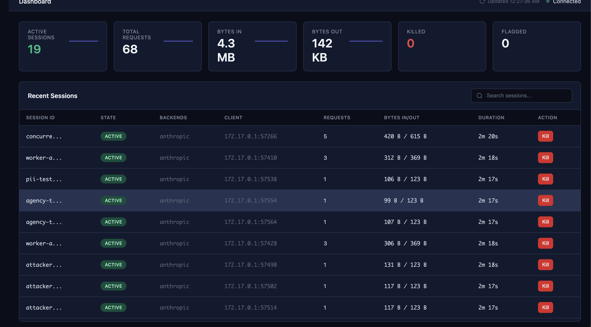

# ELIDA

**Edge Layer for Intelligent Defense of Agents**

Session-aware reverse proxy for AI agent governance. Think Session Border Controller (SBC) from telecom — but instead of managing VoIP calls, ELIDA sits between your AI agents and model APIs, giving you visibility and control over every session.

---

- **Kill runaway agents mid-session** — one API call terminates a session instantly
- **40+ OWASP LLM Top 10 rules** — prompt injection, PII leaks, tool abuse, all caught in-line
- **Session-aware failover** — route across providers (OpenAI, Anthropic, Ollama, Mistral) with sticky sessions
- **Complete audit trail** — every session logged with request/response capture and PII redaction
- **Real-time dashboard** — watch every request, token burn, and policy violation as it happens

## 30-Second Quickstart

```bash
docker run -p 8080:8080 -p 9090:9090 \
  -e ELIDA_BACKEND=https://api.groq.com/openai/v1 \
  zamorofthat/elida:latest
```

Point your client at it:

```bash
# Claude Code
ANTHROPIC_BASE_URL=http://localhost:8080 claude

# Any OpenAI-compatible tool
OPENAI_BASE_URL=http://localhost:8080 your-tool
```

Open the dashboard at [http://localhost:9090](http://localhost:9090).



## How It Works

```
              ┌─────────────────────────────────────────┐
              │                 ELIDA                    │
              │                                         │
              │  ┌───────────┐   ┌──────────────────┐   │
 Agents ──────┼─▶│   Proxy   │──▶│  Multi-Backend   │───┼──▶ OpenAI
              │  │  Handler  │   │     Router       │   │──▶ Anthropic
              │  └─────┬─────┘   └──────────────────┘   │──▶ Ollama
              │        │                                │──▶ Mistral
              │  ┌─────▼─────┐   ┌──────────────────┐   │
              │  │  Session  │   │   Control API    │───┼──▶ :9090
              │  │  Manager  │   │   + Dashboard    │   │
              │  └─────┬─────┘   └──────────────────┘   │
              │        │                                │
              │  ┌─────▼─────┐   ┌──────────────────┐   │
              │  │  Policy   │   │    Telemetry     │   │
              │  │  Engine   │   │  (OTEL/SQLite)   │   │
              │  └───────────┘   └──────────────────┘   │
              └─────────────────────────────────────────┘
```

Every request flows through session tracking and policy evaluation before reaching backends. Sessions are first-class — you can inspect, pause, or kill any agent session via the control API or dashboard.

## Documentation

| | |
|---|---|
| :rocket: **[Getting Started](getting-started.md)** | Install and configure ELIDA in minutes |
| :gear: **[Configuration](configuration.md)** | Full YAML reference and environment variables |
| :shield: **[Security Policies](security-policies.md)** | 40+ rules, presets, and custom rule authoring |
| :electric_plug: **[Control API](api.md)** | REST API for session management and monitoring |
| :chart_with_upwards_trend: **[Telco Controls](telco-controls.md)** | Risk ladder, token tracking, and session forensics |
| :file_cabinet: **[Session Records](session-records.md)** | CDR-style audit trail with full capture |
| :link: **[Integrations](integrations.md)** | LiteLLM, Portkey, Aperture, Oso, and SIEM setup |
